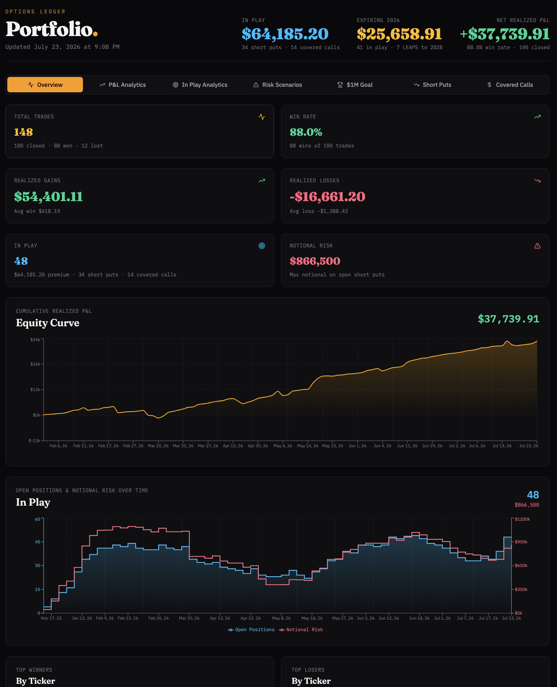

# Options Dashboard

A self-refreshing dashboard for an options-selling book (short puts + covered
calls). A small Python service pulls one Google Sheet on a schedule and writes
`trades.json`; a React dashboard renders it and re-fetches every 10 minutes. No
tool ever gets access to your whole Google Drive — only the one Sheet you share.

An example of the dashboard overview:



## How it works

```
Google Sheet (GOOGLEFINANCE keeps in-play quotes live)
        │  Sheets API — OAuth, scope: spreadsheets.readonly, FORMATTED_VALUE
        ▼
  fetcher/fetch_trades.py ──writes──▶ web/dist/trades.json ──served──▶ dashboard
   (run on a schedule)                 (atomic write)        (static)   (re-fetch/10 min)
```

Three decoupled parts:

- **`fetcher/`** — Python (managed with [uv](https://docs.astral.sh/uv/)). Reads
  the Sheet via OAuth, normalizes rows into trade objects, writes `trades.json`
  atomically. It never overwrites a good file on error, so a stale-but-valid
  dashboard beats a broken one.
- **`web/`** — Vite + React + Tailwind v4. Loads `trades.json` on mount and every
  10 minutes; the analytics/charts recompute from that data.
- **`scripts/`** — optional macOS launchd jobs: one runs the fetcher on a
  10-minute interval, one serves the built app on `http://localhost:4173`. On
  other platforms, run `just fetch` on whatever scheduler you prefer (cron,
  systemd timer, etc.).

## Prerequisites

| Tool | Why | Install |
|------|-----|---------|
| [uv](https://docs.astral.sh/uv/) | Python env + deps for the fetcher | `brew install uv` |
| Node ≥ 20.19 | Build/run the web app — Vite 8 (`.nvmrc` pins 22) | `brew install node` or `nvm use` |
| [just](https://github.com/casey/just) | Task runner (optional but convenient) | `brew install just` |
| [pre-commit](https://pre-commit.com/) | Git hooks (optional) | `pipx install pre-commit` |

## Project layout

```
fetcher/            Python fetcher (uv)
  normalize.py        pure Sheet-row → trade-object transforms
  fetch_trades.py     OAuth + Sheets read + atomic write + CLI entrypoint
  tests/              pytest suite (run against a real sample export)
web/                Vite + React + Tailwind app
  src/App.jsx         data loader (fetch + 10-min refresh + remount-on-change)
  src/TradingDashboard.jsx   the dashboard (reads a tradesData prop)
  src/data.js         trades.json fetch + content hash
scripts/            run_fetch.sh + two launchd .plist files
justfile            task runner (just --list)
```

## One-time setup

1. **Google Cloud:** enable the **Google Sheets API**, then configure the
   **OAuth consent screen** (User type **External**, add the read-only Sheets
   scope, and add your own Google account under **Test users** — the app stays
   in "Testing" mode, so only listed test users can authorize).
2. **OAuth client:** create an OAuth **Desktop app** client and download it to
   `fetcher/credentials.json`.
3. **Share the Sheet** with your own Google account (it already is) — the OAuth
   scope is read-only and limited to Sheets.
4. **Install dependencies:** `just install` (or `cd fetcher && uv sync` and
   `cd web && npm install`).
5. **Build the web app** (creates `web/dist/`, which the fetcher writes into):
   `just build`.
6. **Configure the fetch:** copy `config-example.toml` to `config.toml` at the
   project root and set your `spreadsheet_id`. `config.toml` is git-ignored.
7. **First OAuth consent** (opens a browser once), from `fetcher/`:
   ```bash
   uv run python fetch_trades.py
   ```
   It reads `config.toml`, so no arguments are needed. A browser tab opens for
   you to pick your Google account and grant read-only Sheets access. Because
   the app is unverified, Google warns "Google hasn't verified this app" —
   click **Advanced → Go to … (unsafe)** to continue (safe: it's your own
   client). You should then see `OK: wrote N trades …` and a new
   `fetcher/token.json` (the stored refresh token, so this consent is one-time).

> The Sheet's tab must be named **`Master`** (the default `sheet_range` in
> `config.toml`). If yours differs, set `sheet_range` accordingly.

## Everyday commands

All via `just` (run `just --list` to see them):

| Command | What it does |
|---------|--------------|
| `just dev` | Web app in dev mode with hot reload (`http://localhost:5173`) |
| `just build` | Build the web app to `web/dist/` |
| `just serve` | Serve the built app on `http://localhost:4173` |
| `just fetch` | Run the fetcher once → `web/dist/trades.json` (reads `config.toml`) |
| `just test` | Run all tests (pytest + vitest) |
| `just lint` | Lint everything, no writes (ruff, biome) — no type-checking |
| `just fmt` | Auto-format + auto-fix everything (ruff + biome) |
| `just typecheck` | mypy (strict) + tsc (strict) |
| `just check` | Full gate: `lint` + `typecheck` + `test` |
| `just hooks` | Install the git pre-commit hooks |

Prefer the raw tools? `cd fetcher && uv run pytest` / `uv run ruff check` /
`uv run mypy .`; `cd web && npm test` / `npm run lint` / `npm run format`.

**After changing the dashboard code:** `just build`, then `just fetch` once to
repopulate `web/dist/trades.json`.

## Tooling

All type-checkers and linters run in **strict** mode:

- **Python:** [ruff](https://docs.astral.sh/ruff/) with the full ruleset
  (`select = ["ALL"]`, a few opinion/formatter-conflict rules ignored) plus
  [mypy](https://mypy-lang.org/) `--strict`. Config in `fetcher/pyproject.toml`.
- **Web:** [Biome](https://biomejs.dev/) (lint + format) in a strict posture —
  every bug-catching rule group (`correctness`, `suspicious`, `security`,
  `complexity`, `performance`, `a11y`) enabled in full, not just the recommended
  subset (`web/biome.json`). Plus strict
  [TypeScript](https://www.typescriptlang.org/) via `tsc --noEmit` with
  `strict` + `checkJs` — our authored JS (`App.jsx`, `data.js`, `main.jsx`) is
  type-checked with JSDoc annotations (`tsconfig.json`).
- **Vendored component:** `src/TradingDashboard.jsx` is a large, untyped
  third-party component. It's excluded from Biome and marked `@ts-nocheck`, so
  strict tooling applies to the code we author, not the vendored file. (Its dead
  code was already removed when it was brought in.)
- **Web tests:** Vitest — `data.test.js` covers the loader, and
  `TradingDashboard.test.jsx` is a jsdom render smoke test that mounts the full
  dashboard with fixture data (guards against breakage on dependency upgrades).
  Dependencies track the latest majors and are pinned major-only (e.g. `^19`).
- **Pre-commit:** `.pre-commit-config.yaml` runs ruff, mypy, and Biome on staged
  files via the project's own pinned tool versions. Enable with `just hooks`.

## Troubleshooting

- **Dashboard shows "Could not load trades.json":** the fetcher hasn't produced
  `web/dist/trades.json` yet. Run `just fetch` (after `just build`), or check
  `fetch.err.log`.
- **Browser consent re-appears / token errors:** delete `fetcher/token.json` and
  re-run the step-7 consent command.
- **`just fetch` fails silently:** it needs a valid `config.toml` at the project
  root plus `fetcher/credentials.json` + `fetcher/token.json`; check
  `fetch.err.log`.
- **Empty/zero trades:** the fetcher refuses to overwrite with an empty result,
  so the last good `trades.json` stays in place; check that the tab name matches
  `sheet_range` in `config.toml`.
